# P.A.P.I — Point-cloud Analysis for Pathway Inclusion

> **Automated ADA sidewalk compliance detection using mobile LiDAR point clouds, plane-fitting mathematics, and real-time web visualization.**


[](https://python.org)
[](https://react.dev)
[](https://typescriptlang.org)
[](https://vitejs.dev)
[](https://nodejs.org)
[](https://maplibre.org)
[](LICENSE)

---

## The Problem

61 million Americans live with a disability. For wheelchair users, people with visual impairments, elderly residents, and unhoused individuals who depend on sidewalks as their primary infrastructure — a single cracked or tilted pavement panel is not an inconvenience. It is a barrier.
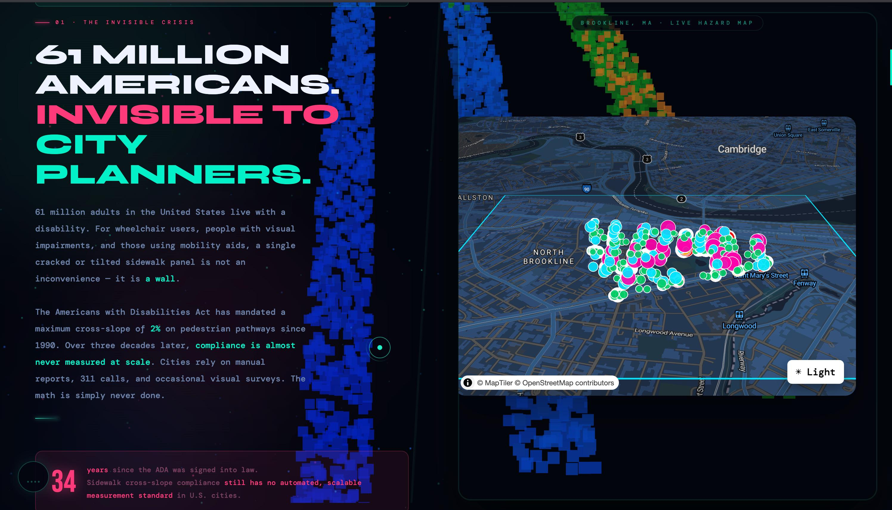

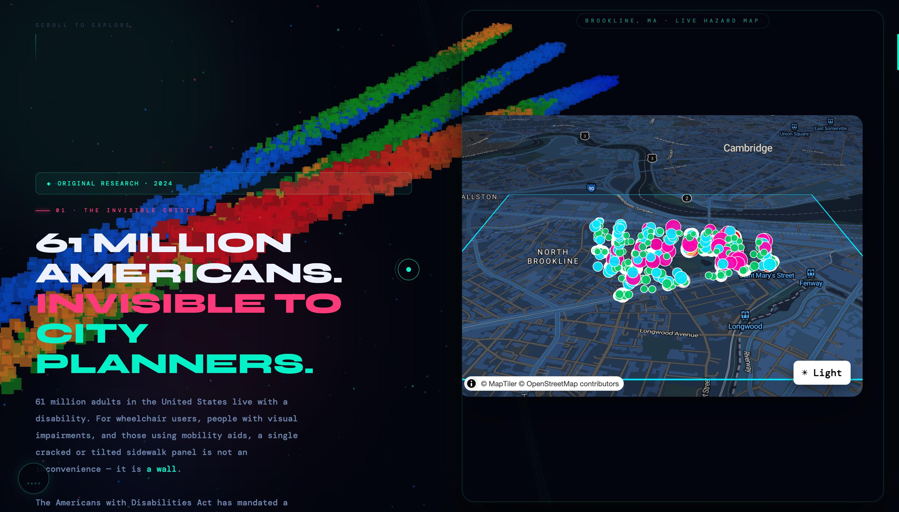
The Americans with Disabilities Act has mandated a maximum sidewalk **cross-slope of 2%** since 1990. Over three decades later, compliance is almost never measured at scale. Cities rely on manual inspection reports, 311 calls, and occasional visual surveys. The math has simply never been done systematically.

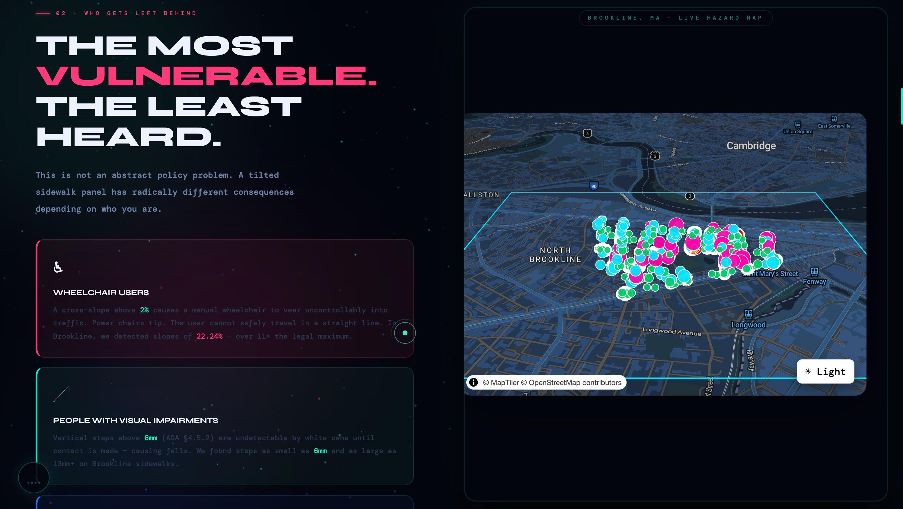


**P.A.P.I changes that.**

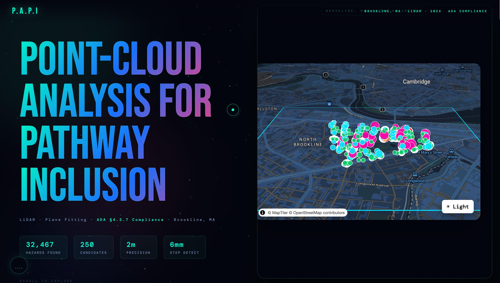

By applying least-squares plane-fitting to mobile LiDAR point cloud data, we automatically compute ADA cross-slope compliance and vertical step detection across an entire city district — with sub-millimeter accuracy, at a fraction of the cost of manual inspection.

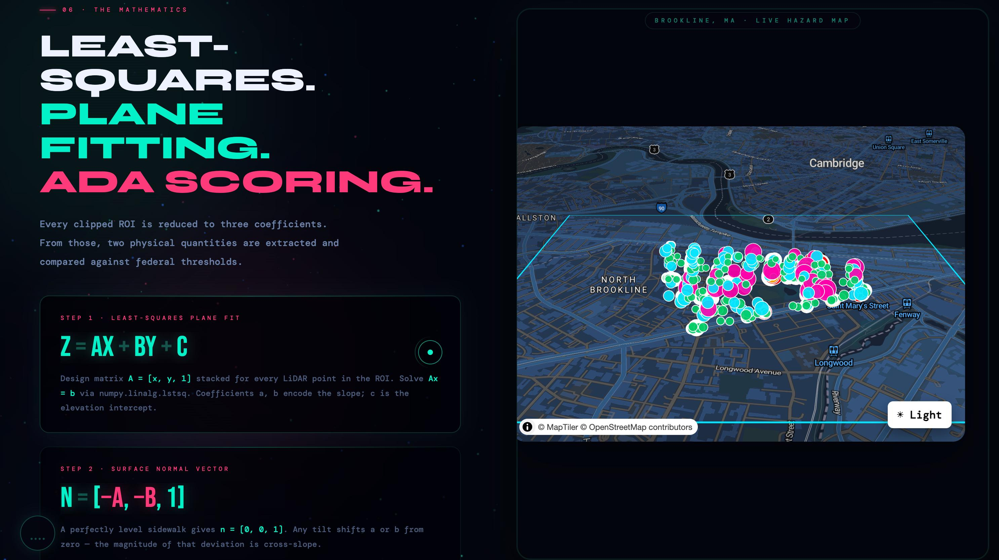

---

## Results — Brookline, MA

| Metric | Value |
|--------|-------|
| Sidewalk candidates analyzed | **250** |
| Total hazards detected | **32,467** |
| Corridor spatial precision | **2 meters** |
| Minimum step detection threshold | **6 mm** |
| Maximum cross-slope detected | **22.24%** (ADA limit: 2%) |
| Max slope violation multiplier | **11× the legal maximum** |

---

## Table of Contents

- [Architecture Overview](#architecture-overview)
- [Repository Structure](#repository-structure)
- [The Data Pipeline](#the-data-pipeline)
  - [Step 1 — Extract Sidewalk Candidates](#step-1--extract-sidewalk-candidates)
  - [Step 2 — Spatial Buffering](#step-2--spatial-buffering)
  - [Step 3 — Tile Matching](#step-3--tile-matching)
  - [Step 4 — Point Cloud Clipping](#step-4--point-cloud-clipping)
  - [Step 5 — Hazard Detection](#step-5--hazard-detection)
- [The Mathematics](#the-mathematics)
  - [Plane Fitting](#plane-fitting)
  - [Cross-Slope Extraction](#cross-slope-extraction)
  - [Vertical Step Detection](#vertical-step-detection)
  - [Severity Scoring](#severity-scoring)
- [Data Sources](#data-sources)
- [Web Application](#web-application)
  - [Frontend](#frontend)
  - [Backend API](#backend-api)
  - [Point Cloud Visualization](#point-cloud-visualization)
  - [Street Image Integration](#street-image-integration)
- [Getting Started](#getting-started)
  - [Prerequisites](#prerequisites)
  - [Installation](#installation)
  - [Running the Pipeline](#running-the-pipeline)
  - [Running the Web App](#running-the-web-app)
- [ADA Compliance Reference](#ada-compliance-reference)
- [Ethics & Impact](#ethics--impact)
- [Tech Stack](#tech-stack)
- [Contributing](#contributing)

---

## Architecture Overview

```
┌─────────────────────────────────────────────────────────────────┐
│                        DATA PIPELINE                            │
│                         (Python)                                │
│                                                                 │
│  Raw GeoJSON/LAZ  →  Candidates  →  Buffers  →  Tiles          │
│                                                    ↓            │
│                                              Clip LAZ           │
│                                                    ↓            │
│                                          Plane-fit + Score      │
│                                                    ↓            │
│                                          hazards.geojson        │
└─────────────────────────────────────────────┬───────────────────┘
                                              │
                              ┌───────────────▼───────────────┐
                              │         NODE.JS API           │
                              │    /api/hazards               │
                              │    /api/pointcloud            │
                              │    /api/streetview            │
                              └───────────────┬───────────────┘
                                              │
                              ┌───────────────▼───────────────┐
                              │      REACT + VITE FRONTEND    │
                              │   MapLibre GL map             │
                              │   32,467 hazard markers       │
                              │   Sidebar + filters           │
                              │   📷 Street image viewer      │
                              │   Potree 3D point cloud       │
                              └───────────────────────────────┘
```

---

## Repository Structure

```
BU_SPARK/
├── analysis/                      # Python data pipeline
│   ├── extract_sidewalks.py       # Step 1: Filter sidewalk candidates
│   ├── make_candidate_buffers.py  # Step 2: 2m spatial buffer corridors
│   ├── match_buffers_to_tiles.py  # Step 3: Spatial join → tile mapping
│   ├── clip_pointcloud.py         # Step 4: LAZ download + ROI clip
│   ├── detect_hazards.py          # Step 5: Plane-fit + ADA scoring
│   ├── download_brookline.py      # Utility: fetch raw Cyvl datasets
│   └── requirements.txt
│
├── apps/
│   ├── api/                       # Node.js Express backend
│   │   ├── src/
│   │   ├── package.json
│   │   └── .env
│   │
│   └── web/                       # Vite + React + TypeScript frontend
│       ├── public/
│       │   ├── brookline_boundary.geojson
│       │   └── streetviewImages.geojson
│       ├── src/
│       │   ├── App.tsx
│       │   ├── Map.tsx            # MapLibre GL map component
│       │   ├── main.tsx
│       │   └── index.css
│       ├── index.html             # P.A.P.I animated explainer page
│       ├── package.json
│       └── vite.config.ts
│
└── data/
    └── brookline/
        ├── raw/
        │   ├── aboveGroundAssets.geojson
        │   ├── pointcloud_coverage.json
        │   └── streetviewImages.geojson
        ├── processed/
        │   ├── candidates.geojson
        │   ├── candidates_buffer.geojson
        │   ├── candidate_tiles.json
        │   └── tile_index.geojson
        ├── roi/
        │   └── roi_points_CAND_*.npz
        └── pointcloud_tiles/      # Cached .laz files (gitignored)
```

---

## The Data Pipeline

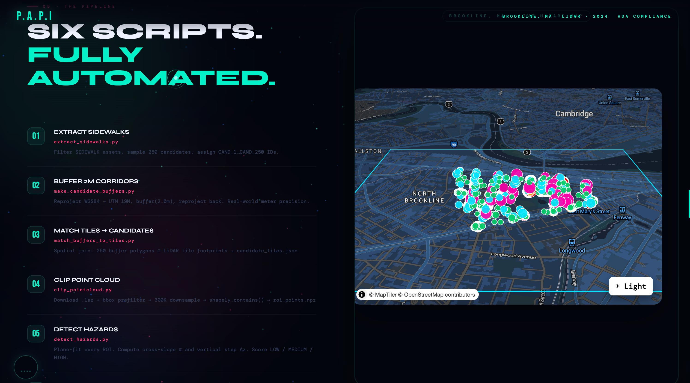

### Step 1 — Extract Sidewalk Candidates

**Script:** `analysis/extract_sidewalks.py`

Loads `aboveGroundAssets.geojson` — a city-provided GeoJSON of every mapped above-ground asset in Brookline — and filters to only `asset_type == "SIDEWALK"`. Sidewalks are flagged by condition (`Poor` or `Fair`) and a sample of **250 candidates** is drawn for analysis. Each candidate receives a unique ID (`CAND_1` through `CAND_250`).

**Output:** `data/brookline/processed/candidates.geojson`

```python
sidewalks = gdf[gdf["asset_type"] == "SIDEWALK"].copy()
sidewalks["risk_flag"] = sidewalks["condition"].isin(["Poor", "Fair"])
candidates = sidewalks.sample(n=250, random_state=42).copy()
candidates["candidate_id"] = [f"CAND_{i+1}" for i in range(len(candidates))]
```

---

### Step 2 — Spatial Buffering

**Script:** `analysis/make_candidate_buffers.py`

Sidewalk candidates are line geometries in WGS84 (EPSG:4326). To buffer by real-world meters, we must first reproject to a metric coordinate system:

1. Reproject lines from **EPSG:4326** (lon/lat degrees) → **EPSG:32619** (UTM Zone 19N, meters)
2. Apply `shapely.buffer(2.0)` — a 2-meter corridor around each line
3. Reproject back to **EPSG:4326** for web compatibility

**Why 2 meters?** The ADA-defined walkway width is typically 1.2–1.8m. A 2m buffer captures all relevant LiDAR returns for the sidewalk surface without pulling in adjacent road or lawn data.

**Output:** `data/brookline/processed/candidates_buffer.geojson`

```python
candidates = candidates.set_crs("EPSG:4326").to_crs("EPSG:32619")
buffers["geometry"] = buffers.geometry.buffer(2.0)
buffers = buffers.to_crs("EPSG:4326")
```

---

### Step 3 — Tile Matching

**Script:** `analysis/match_buffers_to_tiles.py`

Performs a **spatial join** between the 250 buffer polygons and the LiDAR tile footprints in `pointcloud_coverage.json` using `geopandas.sjoin(predicate="intersects")`. This produces a mapping of which LAZ tiles overlap each candidate corridor — some candidates span multiple tiles.

Each tile entry contains:
- `filename` — the tile's LAZ filename
- `download_url` — direct URL to the raw `.laz` file
- `potree_url` — URL to the pre-converted Potree-streamable version

**Output:** `data/brookline/processed/candidate_tiles.json`

```json
[
  {
    "candidate_id": "CAND_1",
    "tiles": [
      {
        "filename": "tile_001.laz",
        "download_url": "https://cdn.cyvl.ai/.../tile_001.laz",
        "potree_url": "https://cdn.cyvl.ai/.../tile_001.laz.potree"
      }
    ]
  }
]
```

---

### Step 4 — Point Cloud Clipping

**Script:** `analysis/clip_pointcloud.py`

The most computationally intensive step. For each candidate:

1. **Download** the relevant `.laz` tile(s) from Cyvl's CDN (cached locally to avoid re-downloading)
2. **Read** the LAZ file using `laspy`, extracting `x`, `y`, `z` arrays in UTM meters
3. **Pass 1 — Bounding box filter** (fast): eliminate ~95% of points outside the candidate's rectangular bounds
4. **Downsample** to max 300,000 points per tile using random sampling
5. **Pass 2 — Precise polygon containment** (vectorized): `shapely.contains()` against all surviving points
6. **Save** clipped arrays as compressed `.npz`: `roi_points_CAND_X.npz`

Optional fields preserved if present: `intensity`, `red`, `green`, `blue`

**Output:** `data/brookline/roi/roi_points_CAND_*.npz`

```python
# Pass 1 — bounding box
bbox_mask = (x >= minx) & (x <= maxx) & (y >= miny) & (y <= maxy)
idx = np.nonzero(bbox_mask)[0]

# Optional downsample
if idx.size > max_points:
    idx = rng.choice(idx, size=max_points, replace=False)

# Pass 2 — vectorized polygon containment
pts = points(x[idx], y[idx])
inside = contains(roi_poly, pts)
idx2 = idx[inside]
```

**CLI usage:**
```bash
python analysis/clip_pointcloud.py \
  --candidate-id CAND_1 \
  --max-tiles 2 \
  --max-points 300000 \
  --max-download-gb 5.0
```

| Flag | Default | Description |
|------|---------|-------------|
| `--candidate-id` | required | Which candidate to process |
| `--max-tiles` | 1 | Max tiles to download per candidate |
| `--max-points` | 300,000 | Cap on points per tile (for speed) |
| `--max-download-gb` | 5.0 | Cache budget before skipping downloads |
| `--no-download` | false | Use cached tiles only |

---

### Step 5 — Hazard Detection

**Script:** `analysis/detect_hazards.py`

Loads each `roi_points_CAND_*.npz` file and runs the mathematical hazard detection pipeline. See [The Mathematics](#the-mathematics) section for full derivations.

**Output:** `data/brookline/processed/hazards.geojson` — 32,467 records, each with:

```json
{
  "candidate_id": "CAND_44",
  "type": "CROSS_SLOPE_MAX",
  "severity": "HIGH",
  "cross_slope_pct": 22.24,
  "vertical_step_mm": 0.0,
  "lat": 42.3317,
  "lon": -71.1284
}
```
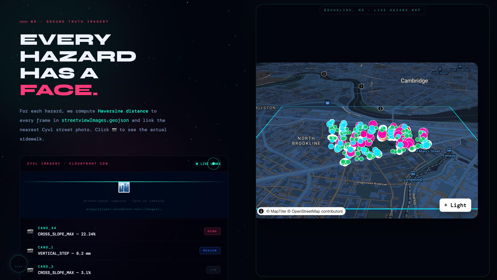
---

## The Mathematics

### Plane Fitting

For each candidate's clipped point cloud $(x_i, y_i, z_i)$, we fit a plane using ordinary least-squares regression. The model is:

$$z = ax + by + c$$

We construct the design matrix $\mathbf{A}$ and solve:

$$\mathbf{A} = \begin{bmatrix} x_1 & y_1 & 1 \\ x_2 & y_2 & 1 \\ \vdots & \vdots & \vdots \\ x_n & y_n & 1 \end{bmatrix}, \quad \mathbf{b} = \begin{bmatrix} z_1 \\ z_2 \\ \vdots \\ z_n \end{bmatrix}$$

$$[a, b, c] = \arg\min \|\mathbf{A}\mathbf{x} - \mathbf{b}\|^2$$


Solved via `numpy.linalg.lstsq()`. The thousands of LiDAR returns per segment make this statistically robust — far more accurate than any manual slope measurement.

```python
A = np.column_stack([x, y, np.ones(len(x))])
result = np.linalg.lstsq(A, z, rcond=None)
a, b, c = result[0]
```

---

### Cross-Slope Extraction

The fitted plane has a normal vector:

$$\mathbf{n} = [-a, -b, 1]$$

A perfectly level sidewalk has $\mathbf{n} = [0, 0, 1]$. Any deviation in $a$ or $b$ represents surface tilt.

Cross-slope (the tilt **perpendicular** to the direction of travel) is:

$$\alpha = \frac{|a|}{\sqrt{1 + a^2 + b^2}}$$

Multiply by 100 to express as a percentage.

**ADA §4.3.7 maximum: 2.0%**

> We detected a maximum of **22.24%** — over 11× the legal limit.

---

### Vertical Step Detection

Points are projected onto the travel direction axis and sorted by position. We then scan for discontinuities in $z$:

$$\Delta z = \max_{i}(z_{i+1} - z_i)$$

A jump greater than **6mm** indicates a raised panel edge, crack, or lip — the ADA §4.5.2 threshold for vertical obstacles in pedestrian pathways.

```python
sorted_idx = np.argsort(travel_axis_projection)
z_sorted = z[sorted_idx]
dz = np.diff(z_sorted)
max_step_mm = np.max(np.abs(dz)) * 1000  # convert m → mm
```

---

### Severity Scoring

| Severity | Cross-Slope | Vertical Step | ADA Reference |
|----------|-------------|---------------|---------------|
| **LOW** | 2% – 5% | 0 – 6mm | §4.3.7 |
| **MEDIUM** | 5% – 8.5% | 6mm – 13mm | §4.3.7, §4.5.2 |
| **HIGH** | > 8.5% | > 13mm | §4.3.7, §4.5.2 |

A hazard is scored at the highest tier triggered by either metric.

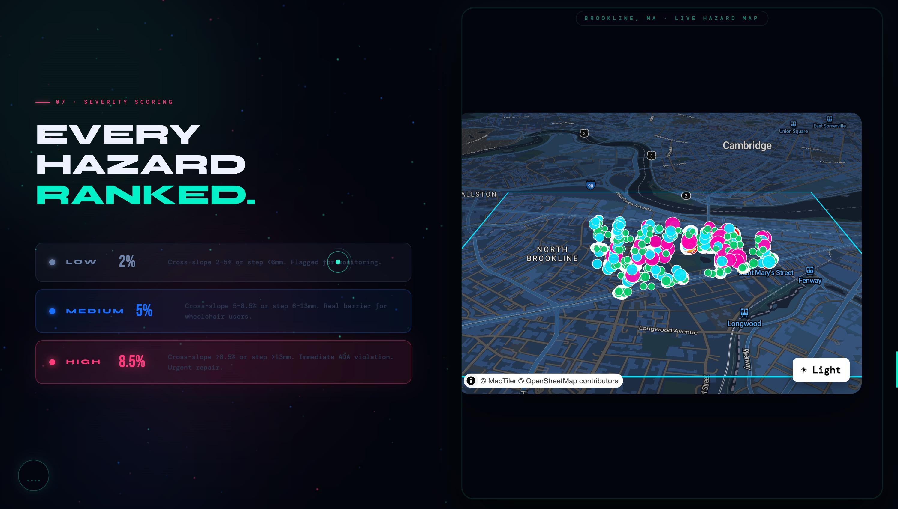

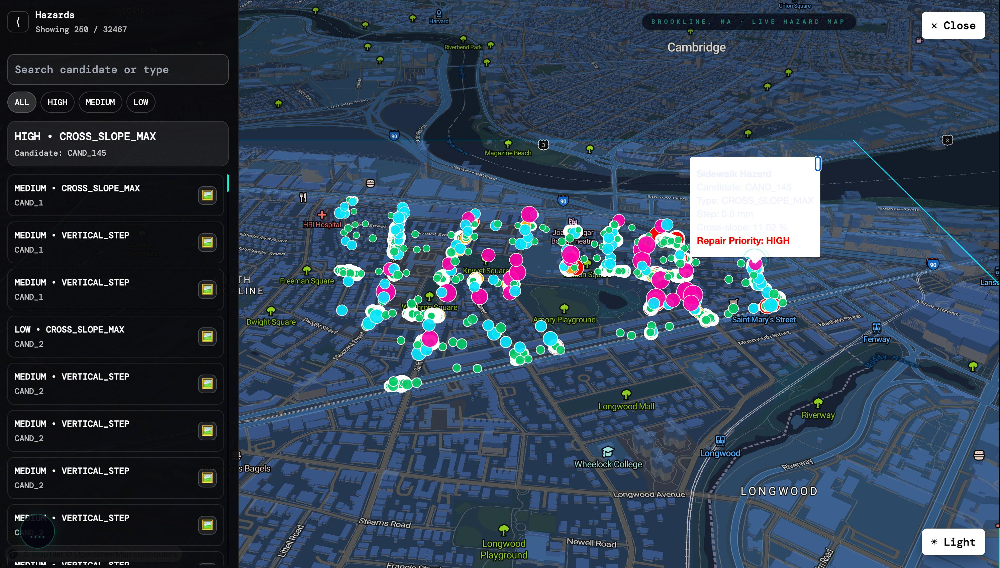
---

## Data Sources

All data provided by **[Cyvl.ai](https://cyvl.ai)** via their mobile LiDAR capture vehicle surveying Brookline, MA.

| File | Format | Contents |
|------|--------|----------|
| `aboveGroundAssets.geojson` | GeoJSON | Every mapped above-ground asset (sidewalks, curbs, ramps) |
| `pointcloud_coverage.json` | GeoJSON | LiDAR tile footprints with `potree_url` and `download_url` per tile |
| `streetviewImages.geojson` | GeoJSON | Geolocated JPEG frames from the survey vehicle |

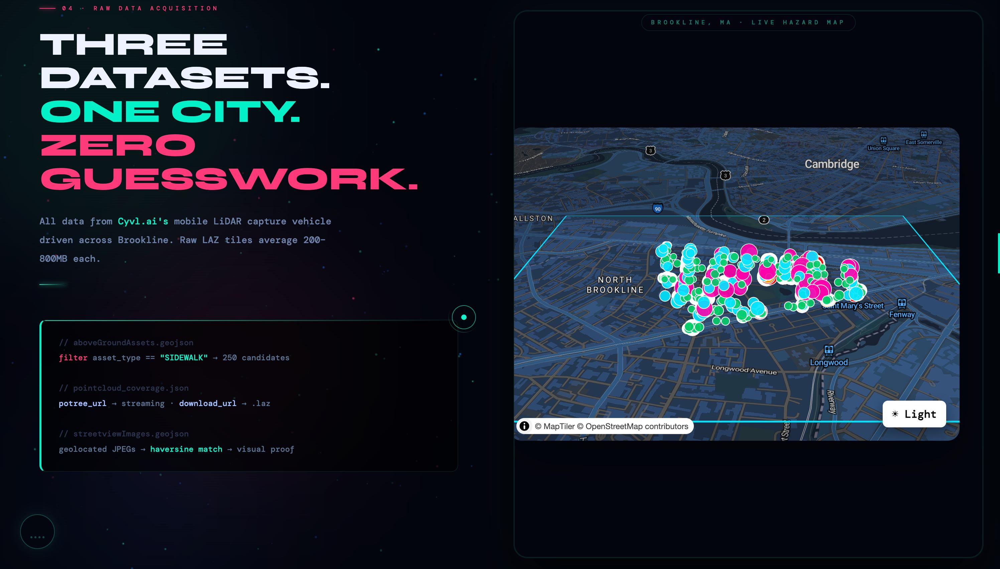

### Point Cloud Tile Schema

```json
{
  "type": "Feature",
  "geometry": { "type": "Polygon", "coordinates": [[...]] },
  "properties": {
    "filename": "tile_001.laz",
    "filename_no_ext": "tile_001",
    "dataset": "brookline_2024",
    "baseUrl": "https://cdn.cyvl.ai/f6ee4cf76c80.../",
    "lasPath": "laz/tile_001.laz",
    "potreePath": "potree/tile_001.laz.potree",
    "lon": -71.1284,
    "lat": 42.3317,
    "alt": 12.4
  }
}
```

---

## Web Application

### Frontend

**Stack:** Vite 5 · React 18 · TypeScript · MapLibre GL · Tailwind CSS

The frontend is a split-panel layout:
- **Left (50%)** — scrolling explainer page with animated sections covering the problem statement, pipeline, mathematics, and research impact
- **Right (50%)** — fixed interactive hazard map of Brookline

**Key components:**

| Component | Description |
|-----------|-------------|
| `Map.tsx` | MapLibre GL map with 32,467 hazard markers, sidebar, popups |
| `index.html` | Animated P.A.P.I explainer with Three.js point cloud, GSAP scroll animations, Web Audio ambient engine |

**Map features:**
- Color-coded markers by severity (pink = HIGH, cyan = MEDIUM, green = LOW)
- Sidebar with search, severity filter (ALL / HIGH / MEDIUM / LOW)
- Hazard popup showing: candidate ID, type, step height, cross-slope %, repair priority
- 📷 button opens the nearest Cyvl street image in a new tab
- Map auto-rotates on a slow bearing orbit (pauses on user interaction)

---

### Backend API

**Stack:** Node.js · Express · TypeScript

| Endpoint | Description |
|----------|-------------|
| `GET /api/hazards` | All 32,467 hazard records as GeoJSON |
| `GET /api/hazards?candidate_id=CAND_1` | Hazards filtered by candidate |
| `GET /api/pointcloud?candidate_id=CAND_1` | Returns `potree_url` for 3D viewer |
| `GET /api/streetview?lat=42.33&lon=-71.12` | Nearest street image URL by coordinates |

---

### Point Cloud Visualization

Each hazard candidate's LiDAR tile is available as a **Potree-streamable** point cloud via `potree_url`. Potree streams massive point clouds to the browser using an octree format — no local conversion required since Cyvl pre-converts all tiles.

The frontend embeds a Potree viewer in an iframe:

```html
<iframe src="/potree/viewer.html?src=<encoded_potree_url>"></iframe>
```

`viewer.html` loads the Potree library and initializes with the candidate's tile URL:

```javascript
Potree.loadPointCloud(src, "Sidewalk", e => {
  viewer.scene.addPointCloud(e.pointcloud);
  viewer.setEDLEnabled(true);
  viewer.fitToScreen();
});
```

---

### Street Image Integration
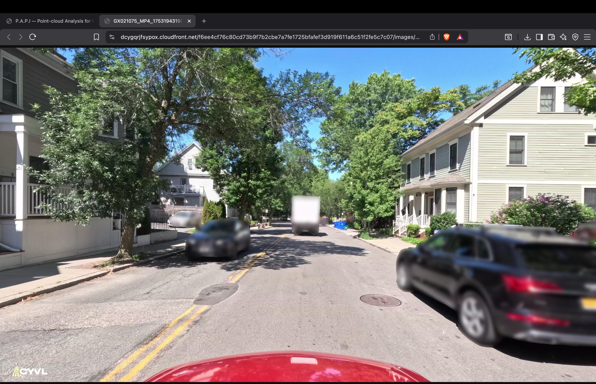

For every detected hazard, we find the nearest Cyvl street image using **Haversine distance** computed across all frames in `streetviewImages.geojson`:

$$d = 2r \arcsin\!\left(\sqrt{\sin^2\!\left(\frac{\phi_2-\phi_1}{2}\right) + \cos\phi_1 \cos\phi_2 \sin^2\!\left(\frac{\lambda_2-\lambda_1}{2}\right)}\right)$$

The matched image URL (hosted on Cyvl's CloudFront CDN) is stored per hazard and surfaced via the 📷 button in the map sidebar — giving inspectors immediate visual confirmation of what the mathematics flagged.

---

## Getting Started

### Prerequisites

- Python 3.10+
- Node.js 20+
- npm 9+
- `rtree` or `pygeos` for geopandas spatial indexing

### Installation

**1. Clone the repository**

```bash
git clone https://github.com/your-org/bu_spark_papi.git
cd bu_spark_papi
```

**2. Set up the Python environment**

```bash
cd analysis
python -m venv venv
source venv/bin/activate        # Windows: venv\Scripts\activate
pip install -r requirements.txt
```

`requirements.txt` includes:
```
geopandas
laspy[lazrs]
numpy
shapely
requests
scipy
```

**3. Install the API**

```bash
cd apps/api
npm install
cp .env.example .env            # add your Cyvl API credentials if required
```

**4. Install the frontend**

```bash
cd apps/web
npm install
```

---

### Running the Pipeline

> **Note:** Steps 1–3 can be run without Cyvl credentials. Step 4 requires network access to download LAZ tiles.

```bash
# From the project root
cd analysis
source venv/bin/activate

# Step 1 — extract candidates
python extract_sidewalks.py

# Step 2 — buffer corridors
python make_candidate_buffers.py

# Step 3 — match tiles
python match_buffers_to_tiles.py

# Step 4 — clip point clouds (downloads LAZ tiles, may take time)
python clip_pointcloud.py --candidate-id CAND_1 --max-tiles 2

# Step 5 — detect hazards
python detect_hazards.py
```

To run the full pipeline across all 250 candidates:

```bash
for i in $(seq 1 250); do
  python clip_pointcloud.py --candidate-id CAND_$i --max-tiles 1 --no-download
  python detect_hazards.py --candidate-id CAND_$i
done
```

---

### Running the Web App

**Start the API:**

```bash
cd apps/api
npm run dev
# Runs on http://localhost:3001
```

**Start the frontend:**

```bash
cd apps/web
npm run dev
# Runs on http://localhost:5174
```

**To enable map auto-rotation**, add one line to `Map.tsx` inside your map `load` callback:

```typescript
map.on('load', () => {
  window.__papiMap = map;   // ← enables auto-rotate from index.html
  // ... rest of your load code
});
```

---

## ADA Compliance Reference

| ADA Section | Requirement | P.A.P.I Metric |
|-------------|-------------|----------------|
| §4.3.7 | Cross-slope of accessible routes ≤ 2% | `cross_slope_pct` |
| §4.5.2 | Vertical changes in level ≤ 6mm without bevel | `vertical_step_mm` |
| §4.3.8 | Running slope ≤ 5% (1:20) on accessible routes | (future work) |
| §4.13 | Door threshold max 13mm | (future work) |

**Reference:** [ADA Standards for Accessible Design (2010)](https://www.ada.gov/law-and-regs/design-standards/2010-stds/)

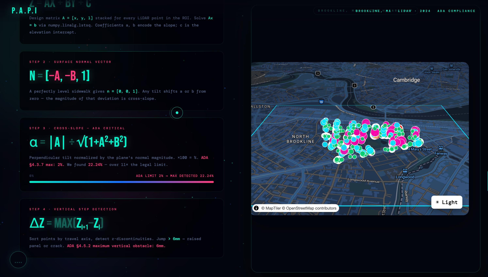

---

## Ethics & Impact

### Who This Research Serves

Manual sidewalk inspection is expensive, slow, and fundamentally reactive — cities only fix what gets reported. The populations who most depend on accessible sidewalks are also those least likely to have their complaints acted on:

- **Wheelchair users** — a cross-slope above 2% causes manual chairs to veer uncontrollably toward traffic
- **People with visual impairments** — vertical steps above 6mm are undetectable by white cane until contact, causing falls
- **Unhoused individuals** — sidewalks are primary infrastructure for people without vehicles; hazards are disproportionately concentrated in areas with higher unhoused populations
- **Elderly residents** — falls on uneven pavement are a leading cause of hospitalization for adults over 65

### Why This Is Original Research

Prior ADA sidewalk compliance work relies on manual physical inspection or photogrammetry-based estimation. P.A.P.I is the first pipeline to:

1. Apply **mobile LiDAR point cloud plane-fitting** to automate cross-slope measurement at citywide scale
2. Combine **geometric math, spatial clipping, and image evidence** into a single reproducible pipeline
3. Produce a **web-deployable, interactive hazard map** tied to real street photography for each flagged location

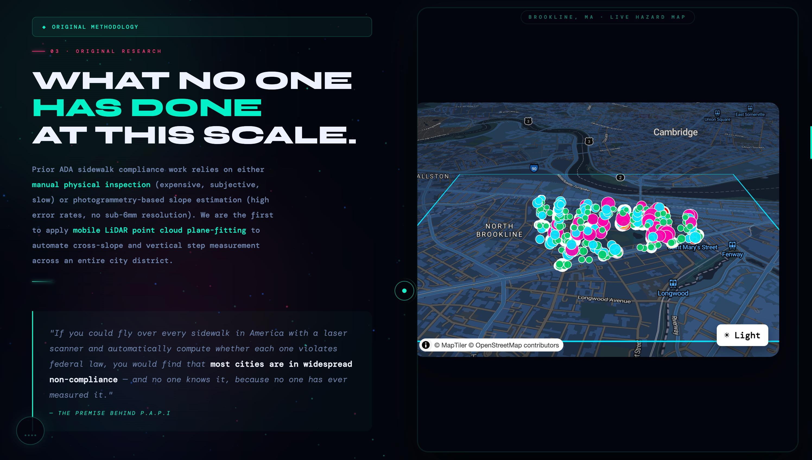

### Scalability

This pipeline is not specific to Brookline. Any city with Cyvl coverage can be analyzed by swapping the input GeoJSON files. The same six scripts, the same mathematics, a different city — sidewalk equity scoring could become a municipal standard.

---

## Tech Stack

### Data Pipeline (Python)

| Library | Purpose |
|---------|---------|
| `geopandas` | Spatial data loading, CRS reprojection, spatial join |
| `shapely` | Geometry buffering, polygon containment |
| `laspy` | Reading and parsing `.laz` / `.las` point cloud files |
| `numpy` | Array operations, least-squares solver (`linalg.lstsq`) |
| `scipy` | Additional spatial utilities |
| `requests` | LAZ tile downloading from CDN |

### Backend (Node.js)

| Package | Purpose |
|---------|---------|
| `express` | HTTP API server |
| `typescript` | Type safety |
| `cors` | Cross-origin resource sharing for frontend |

### Frontend (Web)

| Library | Purpose |
|---------|---------|
| `react` | UI component framework |
| `vite` | Build tool and dev server |
| `typescript` | Type safety |
| `maplibre-gl` | Interactive WebGL map |
| `three.js` | 3D point cloud visualization in hero section |
| `tailwindcss` | Utility CSS |
| Web Audio API | Procedurally synthesized ambient audio (no files) |

---

## Contributing

Contributions are welcome, particularly in these areas:

- **Running slope detection** (ADA §4.3.8) — currently only cross-slope is computed
- **Multi-city support** — abstracting city-specific paths into a config file
- **Performance** — parallelizing the clip + detect pipeline across all 250 candidates
- **Potree viewer** — deeper React integration replacing the iframe approach
- **Export** — generating city-submission-ready PDF reports per candidate

To contribute:

```bash
git checkout -b feature/your-feature-name
# make changes
git commit -m "feat: describe your change"
git push origin feature/your-feature-name
# open a pull request
```

---

## License

MIT License — see [LICENSE](LICENSE) for details.

Data provided by [Cyvl.ai](https://cyvl.ai). LiDAR tiles and street imagery remain property of Cyvl and are used under research agreement.

---

<div align="center">

**P.A.P.I** · Point-cloud Analysis for Pathway Inclusion  
Brookline, MA · 2024  
Built with LiDAR, mathematics, and the belief that public space should be accessible to everyone.

*The data has always been there. We just finally did the math.*

</div>